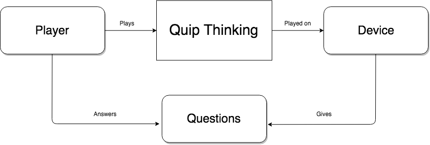

# Quip Thinking Project Requirements

## Functional Requirements

### End-User Observation

### Use Cases

1. **Title:** Create new room (public or private)
    - **Actor:** Player
    - **Scenario:** The player clicks “Create new room” and chooses whether it is public or private. If the room is public, it will show up on the list of public rooms on the front page. If it’s private, the system will generate a unique room code. Players can join the room, and once enough people have joined (at least three), the system will show a button that allows the person who created the game to start the game.

2. **Title:** Join public room
    - **Actor:** Player
    - **Scenario:** The player can see a list of available public rooms that haven’t started playing yet. They choose one and enter a username. The system validates and confirms the username to make sure it isn’t taken by someone else in the room. The player joins the room and begins playing.

3. **Title:** Join game using username and room code
    - **Actor:** Player
    - **Scenario:** The player playing in a private room can use a unique room code to join an existing game. They create a username for the game. The system validates and confirms the username to make sure it isn’t taken by someone else in the room. The player joins the room and begins playing.

4. **Title:** Respond to prompt
    - **Actor:** Player
    - **Scenario:** The system gives out three prompts to each player, pairing them with different players each time (when applicable). The player responds to the prompts and submits their answers.

5. **Title:** Vote on best quips
    - **Actor:** Player
    - **Scenario:** The system presents the prompt and the players’ quips. The people in the game choose the quip they like the most, and the system doles out the points. After each round of prompts (three rounds total), the system will show the number of points of each player.

6. **Title:** Add a prompt
    - **Actor:** Player
    - **Scenario:** The player can add their own prompt to be publically played. They will see a message that their prompt will be reviewed. The system will validate the prompt to make sure that it’s appropriate for others (no curse words or spam messages). The system will then add the prompt to the database.

### Domain Modeling

## Non-Functional Requirementsi

## Requirements Elicitation

### Interviews

**Stakeholders:**
1. Amos Bloomberg
2. Wei-Kai Pan

**Questions:**

*Investor Focused -*

1. Do you have a specific industry you are looking to invest in?
    - Find out about the domain expertise of the stakeholder.
2. Why are the looking to invest in this industry?
3. Do you have similar investments?
4. What are your most successful investments? 
5. On average, how many investments do you make per year and what is the typical size of those investments?
6. When was the last time you made an investment?
7. What is your process like?
    - How do you make a decision?
8. Do you typically have co-investors?
9. Will you want to be personally involved with the company?
    - Will you want a board seat?
10. How do you interact with your founders after investing?
11. What is the first thing you’d want us to do if we worked together?

*User Focused -*

1. Do you usually play party games with your friends?
2. What games do you usually play with friends?
3. What do you look for in a game before deciding if you want to play it?
4. How often do you play games you've already played before?
    - Are you always looking for new games to try?

*Team Focused -*

1. Do you have experience building games?
2. How do you think we can distinguish ourselves from the original game, Quiplash?
3. Do you have any concerns about this project?
4. What would you like to see this project achieve?
