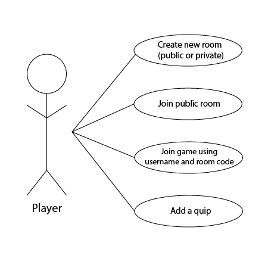

# Quip Thinking Project Requirements
## Functional Requirements
### End-User Observation

### Use Cases

1. **Title:** Create new room (public or private)
    - **Actor:** Player
    - **Scenario:** The player clicks “Create new room” and chooses whether it is public or private. If the room is public, it will show up on the list of public rooms on the front page. If it’s private, the system will generate a unique room code. The player joins the room, and the system will show a timer for two minutes to allow other people to join. Once enough people have joined (at least two), the system will show a button that allows the players to start the game.
    
2. **Title:** Join public room
    - **Actor:** Player
    - **Scenario:** The player can see a list of available public rooms that haven’t started playing yet. They choose one and enter a username. The system validates and confirms the username to make sure it isn’t taken by someone else in the room. The player joins the room and begins playing.

3. **Title:** Join game using username and room code
    - **Actor:** Player
    - **Scenario:** The player playing in a private room can use a unique room code to join an existing game. They create a username for the game. The system validates and confirms the username to make sure it isn’t taken by someone else in the room. The player joins the room and begins playing.

4. **Title:** Add a prompt
    - **Actor:** Player
    - **Scenario:** The player can add their own prompt to be publically played. They will see a message that their prompt will be reviewed. The system will validate the prompt to make sure that it’s appropriate for others (no curse words or spam messages). The system will then add the prompt to the database.

### Domain Modeling

## Non-Functional Requirements